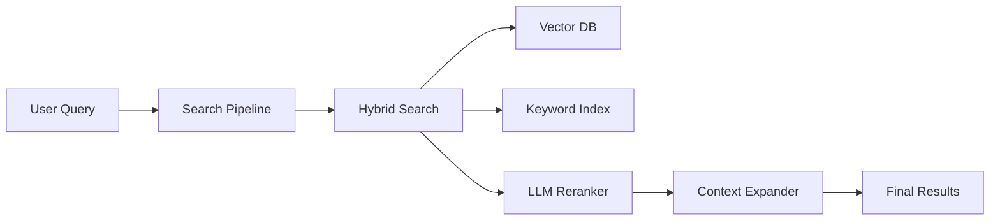

# RAG Pipeline Architecture

This document explains the architecture of the Retrieval-Augmented Generation (RAG) pipeline in XZe.

## Overview

The RAG pipeline consists of two main components:
1.  **Ingestion Pipeline**: Processing documents for storage.
2.  **Search Pipeline**: Retrieving relevant information.

## Ingestion Pipeline

The ingestion process transforms raw text into searchable vectors.

1.  **Scanning**: The system traverses the documentation directory.
2.  **Classification**: Each file is classified into a Diataxis category (Tutorial, How-To, Reference, Explanation) using an LLM. This metadata helps in filtering and ranking.
3.  **Chunking**: Files are split into smaller segments ("chunks"). We use **Intent-Based Chunking**, which attempts to keep semantically related text together rather than splitting arbitrarily by character count.
4.  **Embedding**: Each chunk is converted into a vector embedding using an embedding model (e.g., `llama3`, `nomic-embed-text`).
5.  **Storage**: Chunks and vectors are stored in PostgreSQL with `pgvector`.

## Search Pipeline

The search process retrieves the most relevant chunks for a user query.

1.  **Hybrid Search**:
    *   **Vector Search**: Finds chunks with similar semantic meaning (cosine similarity).
    *   **Keyword Search**: Finds chunks containing specific query terms (BM25/tsvector).
    *   **Fusion**: Results are combined using Reciprocal Rank Fusion (RRF) to balance semantic and keyword matches.

2.  **Reranking (Optional)**:
    *   Top results from the hybrid search are sent to an LLM.
    *   The LLM scores each result based on its relevance to the specific query.
    *   Results are re-ordered based on these scores. This significantly improves precision.

3.  **Context Expansion (Optional)**:
    *   For the top results, the system fetches adjacent chunks (preceding and succeeding).
    *   This provides the LLM with more context during generation, reducing hallucinations and improving answer quality.

## Diagram

